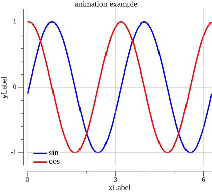

# Plot - Go Wrapper for Data Visualization

Plot is an elegant and intuitive wrapper for the [gonum/plot](https://github.com/gonum/plot) library in Go, inspired by the Matplotlib API. This project simplifies the creation of professional graphics in Go while maintaining the flexibility and power of the underlying library.

## 📋 Features

Plot supports various types of visualizations:

- **📈 Line Graphs** - Plotting data series in 2D with customizable styles
- **🔵 Scatter Plots** - Visualizing points in 2D, with optional colors based on a third axis (Z)
- **📊 Histograms** - Visualizing distributions with optional density curves
- **🗺️ Contour Plots** - Plotting 2D data contours (unfilled)
- **🎨 Filled Contour Plots** - Contours with fill colors (contourf)
- **🖼️ Images** - Visualizing grayscale or RGB image data from matrices
- **🎬 Animations** - Creating animated plots with customizable frame intervals and optional looping
- **🔲 Subplots** - Organizing multiple plots in a single figure

Common plot configuration includes:
- **Customizable** legends for line plots
- **Labels** for X and Y axes
- **Titles** for the plots
- **Axis limits** (XLim and YLim)
- **Grid** for better readability
- **Color gradients** using the colorgrad library for scatter, contour, and filled contour plots
- **Customizable figure size**
- **Save** static plots as PNG files or animations as GIF files, or **Show** them in a graphical window

## 🎯 Usage Examples

### 1. Line Plot

```go
// examples/line/line.go
package main

import (
	"github.com/adynascimento/plot/plotter"
	"gonum.org/v1/gonum/mat"
)

func main() {
	// create and configure plot
	plt := plotter.NewPlot()
	plt.FigSize(11, 10)

	plt.Plot(x.RawMatrix().Data, func1.RawMatrix().Data,
		plotter.WithLineColor(plotter.Blue),
		plotter.WithLineStyle(plotter.DashDotted),
		plotter.WithLineMarker(plotter.Circle),
		plotter.WithLineMarkerSpacing(8),
	)

	plt.Plot(x.RawMatrix().Data, func2.RawMatrix().Data,
		plotter.WithLineColor(plotter.Red),
		plotter.WithLineMarker(plotter.Square),
		plotter.WithLineMarkerSpacing(8),
	)

	plt.Title("plot example")
	plt.XLabel("xLabel")
	plt.YLabel("yLabel")
	plt.Legend("line1", "line2").Location(plotter.LowerLeft)
	plt.Grid()
	
	// save figure
	plt.Save("line.png")
}
```

**Output:**


---

### 2. Scatter Plot with Color Gradient

```go
// examples/scatter/scatter.go
package main

import (
	"github.com/adynascimento/plot/plotter"
	"github.com/mazznoer/colorgrad"
)

func main() {
	plt := plotter.NewPlot()
	plt.FigSize(10, 9)

	plt.Scatter(x, y, Z,
		plotter.WithScatterGradient(colorgrad.Viridis()),
		plotter.WithScatterMarker(plotter.Circle),
		plotter.WithScatterColorbar(plotter.Vertical),
	)
	plt.Title("scatter plot example")
	plt.XLabel("xLabel")
	plt.YLabel("yLabel")
	plt.XLim(-3, 3)
	plt.YLim(-3, 3)
	plt.Grid()

	plt.Save("scatter.png")
}
```

**Output:**


---

### 3. Histogram

```go
// examples/histogram/histogram.go
package main

import (
	"github.com/adynascimento/plot/plotter"
)

func main() {
	plt := plotter.NewPlot()
	plt.FigSize(10, 10)

	plt.Hist(x, 16,
		plotter.WithHistFillColor(plotter.Gray),
		plotter.WithHistKDECurve(plotter.Blue),
		plotter.WithHistNormalCurve(plotter.Red),
	)
	plt.Title("histogram plot example")
	plt.Legend("kde curve", "normal curve").Location(plotter.UpperRight)
	plt.XLabel("x")

	plt.Save("histogram.png")
}
```

**Output:**


---

### 4. Contour Plot

```go
// examples/contour/contour.go
package main

import (
	"github.com/adynascimento/plot/plotter"
	"github.com/mazznoer/colorgrad"
	"gonum.org/v1/gonum/mat"
)

func main() {
	plt := plotter.NewPlot()
	plt.FigSize(10, 10)

	plt.Contour(x, y, Z,
		plotter.WithContourLevels(12),
		plotter.WithContourGradient(colorgrad.Turbo()),
		plotter.WithContourLineStyle(plotter.Dashed),
	)
	plt.Title("contour plot example")
	plt.XLabel("xLabel")
	plt.YLabel("yLabel")

	plt.Save("contour.png")
}
```

**Output:**


---

### 5. Filled Contour Plot

```go
// examples/contourf/contourf.go
package main

import (
	"github.com/adynascimento/plot/plotter"
	"github.com/mazznoer/colorgrad"
	"gonum.org/v1/gonum/mat"
)

func main() {
	plt := plotter.NewPlot()
	plt.FigSize(10, 10)

	plt.ContourF(x, y, Z,
		plotter.WithContourLevels(12),
		plotter.WithContourGradient(colorgrad.Viridis()),
		plotter.WithContourLines(),
		plotter.WithContourLineStyle(plotter.Dashed),
		plotter.WithContourColorbar(plotter.Vertical),
	)
	plt.Title("contourf plot example")
	plt.XLabel("xLabel")
	plt.YLabel("yLabel")

	plt.Save("contourf.png")
}
```

**Output:**


---

### 6. Image Display (ImShow)

```go
// examples/image/image.go
package main

import (
	"github.com/adynascimento/plot/plotter"
	"gonum.org/v1/gonum/mat"
)

func main() {
	plt := plotter.NewPlot()
	plt.FigSize(9, 9)

	plt.ImShow(x)
	plt.Title("image plot example")

	plt.Save("image.png")
}
```

**Output:**


---

### 7. Animations

```go
// examples/animation/animation.go
package main

import (
	"github.com/adynascimento/plot/plotter"
	"gonum.org/v1/gonum/mat"
)

func main() {
	plt := plotter.NewPlot()
	plt.FigSize(11, 10)

	update := func(frame int) {
		plt.Clear()

		// recompute the wave every frame
		phase := float64(frame) * 0.10
		y1 := plotter.Apply(func(_, _ int, v float64) float64 { return math.Sin(2*v - phase) }, x)
		y2 := plotter.Apply(func(_, _ int, v float64) float64 { return math.Cos(2*v - phase) }, x)

		plt.Plot(x.RawMatrix().Data, y1.RawMatrix().Data,
			plotter.WithLineColor(plotter.Blue),
			plotter.WithLineWidth(2),
		)

		plt.Plot(x.RawMatrix().Data, y2.RawMatrix().Data,
			plotter.WithLineColor(plotter.Red),
			plotter.WithLineWidth(2),
		)

		plt.Title("Animation Example")
		plt.Legend("sin", "cos").Location(plotter.LowerLeft)
		plt.XLabel("xLabel")
		plt.YLabel("yLabel")
		plt.XLim(0, 2*math.Pi)
		plt.YLim(-1.2, 1.2)
		plt.Grid()
	}

	nFrames := 240
	plt.Animation(nFrames, update,
		plotter.WithAnimationInterval(40*time.Millisecond),
		plotter.WithAnimationLoop(true),
	)

	plt.Save("animation.gif")
	plt.Show()
}
```

**Output:**



---

### 8. Subplots

```go
// examples/subplot/subplot.go
package main

import (
	"github.com/adynascimento/plot/plotter"
	"gonum.org/v1/gonum/mat"
)

func main() {
	// create subplot with 1 row and 2 columns
	plt := plotter.NewSubplot(1, 2)
	plt.FigSize(23, 10)

	// first subplot (0, 0)
	subplt := plt.Subplot(0, 0)
	subplt.Plot(x.RawMatrix().Data, func1.RawMatrix().Data)
	subplt.Plot(x.RawMatrix().Data, func2.RawMatrix().Data)
	subplt.Title("Sine Function")
	subplt.XLabel("X")
	subplt.YLabel("Y")
	subplt.Legend("sin1", "sin2")
	subplt.Grid()

	// second subplot (0, 1)
	subplt = plt.Subplot(0, 1)
	subplt.Plot(x.RawMatrix().Data, func3.RawMatrix().Data)
	subplt.Plot(x.RawMatrix().Data, func4.RawMatrix().Data)
	subplt.Title("Tangent Function")
	subplt.XLabel("X")
	subplt.YLabel("Y")
	subplt.Legend("tan1", "tan2")
	subplt.Grid()

	plt.Save("subplot.png")
}
```

**Output:**


---

## 🎨 Customization Options

### Line Colors

```go
plt.Plot(x, y, plotter.WithLineColor(plotter.Blue))
```

Available predefined colors:
- `plotter.Black`
- `plotter.Red`
- `plotter.Green`
- `plotter.Blue`
- `plotter.Cyan`
- `plotter.Magenta`
- `plotter.Orange`
- `plotter.Purple`
- `plotter.Yellow`
- `plotter.Gray`

### Line Styles

```go
plt.Plot(x, y, plotter.WithLineStyle(plotter.Dashed))
```

Available line styles:
- `plotter.Solid` - Solid line
- `plotter.Dashed` - Dashed line
- `plotter.Dotted` - Dotted line
- `plotter.DashDotted` - Dash-dot line

### Markers

```go
plt.Plot(x, y, plotter.WithLineMarker(plotter.Circle))
plt.Plot(x, y, plotter.WithLineMarkerSpacing(8)) // spacing between markers
plt.Plot(x, y, plotter.WithLineMarkerSize(4))
```

Available marker types:
- `plotter.Circle`
- `plotter.Square`
- `plotter.Triangle`
- `plotter.PlusSign`
- `plotter.CrossSign`

### Public Options

Line plots:

```go
plt.Plot(x, y,
	plotter.WithLineColor(plotter.Blue),
	plotter.WithLineWidth(2),
	plotter.WithLineStyle(plotter.Dashed),
	plotter.WithLineMarker(plotter.Circle),
	plotter.WithLineMarkerSize(4),
	plotter.WithLineMarkerSpacing(8),
)
```

Scatter plots:

```go
plt.Scatter(x, y, nil,
	plotter.WithScatterMarkerColor(plotter.Red),
	plotter.WithScatterMarker(plotter.CrossSign),
	plotter.WithScatterMarkerSize(5),
)
```

Contour and filled contour plots:

```go
plt.Contour(x, y, z,
	plotter.WithContourLevels(12),
	plotter.WithContourGradient(colorgrad.Turbo()),
	plotter.WithContourLineWidth(2),
	plotter.WithContourLineStyle(plotter.Dashed),
)
```

Histograms:

```go
plt.Hist(x, 16,
	plotter.WithHistFillColor(plotter.Gray),
	plotter.WithHistLineColor(plotter.Black),
	plotter.WithHistLineWidth(1.5),
	plotter.WithHistLineStyle(plotter.Solid),
	plotter.WithHistKDECurve(plotter.Red),
)
```

### Color Gradients

The library supports gradients from the `colorgrad` package:
- `colorgrad.Viridis()` - Viridis
- `colorgrad.Plasma()` - Plasma
- `colorgrad.Inferno()` - Inferno
- `colorgrad.Magma()` - Magma
- `colorgrad.Cividis()` - Cividis
- `colorgrad.Turbo()` - Turbo
- And many others...

```go
plt.Scatter(x, y, z, plotter.WithScatterGradient(colorgrad.Viridis()))
plt.Contour(x, y, z, plotter.WithContourGradient(colorgrad.Turbo()))
```

### Colorbars

For gradient-based visualizations, add a colorbar:

```go
// for scatter plots
plt.Scatter(x, y, z, plotter.WithScatterColorbar(plotter.Vertical))

// for filled contour plots
plt.ContourF(x, y, z, plotter.WithContourColorbar(plotter.Vertical))
```

Colorbar orientations:
- `plotter.Vertical` - Vertical colorbar
- `plotter.Horizontal` - Horizontal colorbar

### Displaying Figures

Use `Save` to write the figure to a PNG file or an animation as a GIF file. Use `Show` to open the rendered plot in a graphical window:

```go
plt.Save("plot.png")
plt.Show()
```

### Scatter Without Z Values

Scatter plots can be used as simple 2D point plots by passing `nil` or an empty slice for `z`:

```go
plt.Scatter(x, y, nil,
	plotter.WithScatterMarkerColor(plotter.Blue),
	plotter.WithScatterMarker(plotter.Circle),
)
```

### Grayscale Images

`ImShow` accepts one matrix for grayscale images or three matrices for RGB images:

```go
gray := mat.NewDense(rows, cols, pixels)
plt.ImShow([]*mat.Dense{gray})
```

---

## 🚀 Installation

### Prerequisites
- Go 1.22 or higher
- Gonum and other dependencies are managed by Go modules

### Steps

Install the package in your Go project:

```bash
go get github.com/adynascimento/plot
```

Then import it:

```go
import "github.com/adynascimento/plot/plotter"
```

To run the examples from this repository:

```bash
cd examples/contourf
go run contourf.go
```

---

## 📦 Main Dependencies

The project uses the following main libraries:

- **Gonum plot**: Plotting engine ([github.com/gonum/plot](https://github.com/gonum/plot))
- **Gonum**: Numerical operations ([github.com/gonum/gonum](https://github.com/gonum/gonum))
- **Colorgrad**: Color gradient generation ([github.com/mazznoer/colorgrad](https://github.com/mazznoer/colorgrad))

---

## 🔧 Utility Functions

### Linspace

Creates a linearly spaced array of float64 values:

```go
x := plotter.Linspace(0, 10, 100) // 100 values from 0 to 10
```

### Apply

Applies a function element-wise to a matrix:

```go
x := mat.NewDense(1, 100, plotter.Linspace(0, 1, 100))
y := plotter.Apply(func(i, j int, v float64) float64 {
    return math.Sin(v)
}, x)
```

---

## 📝 License

This project is licensed under the MIT License. See the [MIT LICENSE](LICENSE) file for details.

---

## 🤝 Contributing

Contributions are welcome! Please open issues or pull requests for improvements.

---

## 📚 Additional Resources

- [Gonum Documentation](https://www.gonum.org/)
- [Gonum Plot](https://github.com/gonum/plot)
- [Colorgrad](https://github.com/mazznoer/colorgrad)
