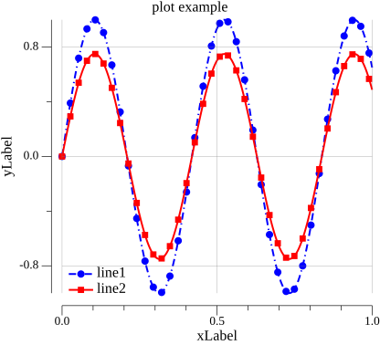
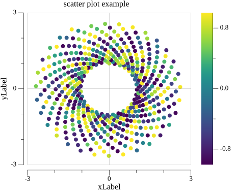
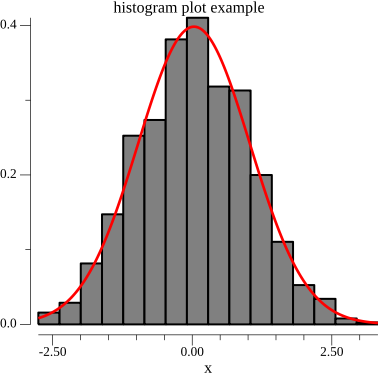
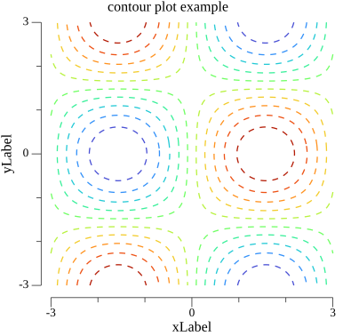
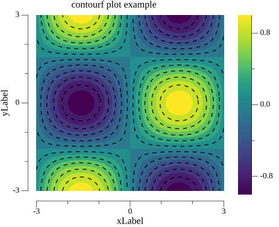
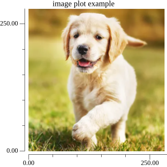
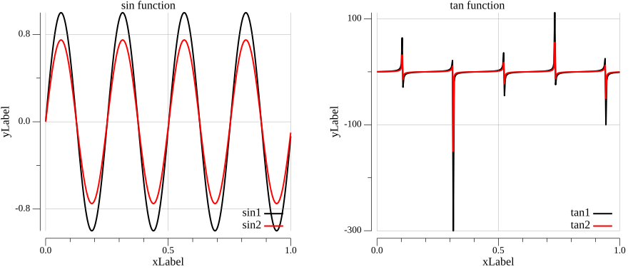

# Plot - Go Wrapper for Data Visualization

Plot is an elegant and intuitive wrapper for the [gonum/plot](https://github.com/gonum/plot) library in Go, inspired by the Matplotlib API. This project simplifies the creation of professional graphics in Go while maintaining the flexibility and power of the underlying library.

## 📋 Features

Plot supports various types of visualizations:

- **📈 Line Graphs** - Plotting data series in 2D with customizable styles
- **📊 Scatter Plots** - Visualizing points in 2D, with optional colors based on a third axis (Z)
- **📊 Histograms** - Visualizing distributions with optional density curves
- **🗺️ Contour Plots** - Plotting 2D data contours (unfilled)
- **🗺️ Filled Contour Plots** - Contours with fill colors (contourf)
- **🖼️ Images** - Visualizing grayscale or RGB image data from matrices
- **🔲 Subplots** - Organizing multiple plots in a single figure

Common plot configuration includes:
- **Customizable** legends for line plots
- **Labels** for X and Y axes
- **Titles** for the plots
- **Axis limits** (XLim and YLim)
- **Grid** for better readability
- **Color gradients** using the colorgrad library for scatter, contour, and filled contour plots
- **Customizable figure size**
- **Save** to PNG files or **Show** in a graphical window

## 🎯 Usage Examples

### 1. Line Plot

```go
// examples/line/line.go
package main

import (
	"math"
	"github.com/adynascimento/plot/plotter"
	"gonum.org/v1/gonum/mat"
)

func main() {
	// create data
	x := mat.NewDense(1, 300, plotter.Linspace(0., 1., 300))
	
	applyFunc := func(_, _ int, v float64) float64 { 
		return math.Sin(15. * v) 
	}
	y := plotter.Apply(applyFunc, x)

	// create and configure plot
	plt := plotter.NewPlot()
	plt.FigSize(10, 8)
	
	plt.Plot(x.RawMatrix().Data, y.RawMatrix().Data,
		plotter.WithLineColor(plotter.Blue),
		plotter.WithLineStyle(plotter.DashDotted),
		plotter.WithMarker(plotter.Circle),
		plotter.WithMarkerSpacing(8),
	)

	plt.Title("Line Plot Example")
	plt.XLabel("X Axis")
	plt.YLabel("Y Axis")
	plt.Grid()
	
	// save figure
	plt.Save("line.png")
}
```

**Output:**



---

### 2. Scatter Plot with Color Gradient

```go
// examples/scatter/scatter.go
package main

import (
	"math"
	"math/rand"
	"github.com/adynascimento/plot/plotter"
	"github.com/mazznoer/colorgrad"
)

func main() {
	rnd := rand.New(rand.NewSource(1))
	n := 500
	
	theta := plotter.Linspace(0, 1, n)
	x := make([]float64, n)
	y := make([]float64, n)
	z := make([]float64, n)
	
	for i := range x {
		x[i] = math.Exp(theta[i]) * math.Sin(100.*theta[i])
		y[i] = math.Exp(theta[i]) * math.Cos(100.*theta[i])
		z[i] = math.Cos(30. * rnd.Float64())
	}

	plt := plotter.NewPlot()
	plt.FigSize(10, 9)

	plt.Scatter(x, y, z,
		plotter.WithScatterGradient(colorgrad.Viridis()),
		plotter.WithScatterMarker(plotter.Circle),
		plotter.WithScatterColorbar(plotter.Vertical),
	)
	
	plt.Title("Scatter Plot with Colorbar")
	plt.XLabel("X")
	plt.YLabel("Y")
	plt.Grid()
	plt.Save("scatter.png")
}
```

**Output:**



---

### 3. Histogram

```go
// examples/histogram/histogram.go
package main

import (
	"math/rand/v2"

	"github.com/adynascimento/plot/plotter"
)

func main() {
	// histogram plot
	x := make([]float64, 1000)
	for i := range x {
		x[i] = rand.NormFloat64()
	}

	plt := plotter.NewPlot()
	plt.FigSize(10, 10)

	plt.Hist(x, 16,
		plotter.WithHistFillColor(plotter.Gray),
		plotter.WithHistDensityCurve(plotter.Red),
	)
	plt.Title("histogram plot example")
	plt.XLabel("x")
	plt.Save("histogram.png")
}
```

**Output:**



---

### 4. Contour Plot

```go
// examples/contour/contour.go
package main

import (
	"math"
	"github.com/adynascimento/plot/plotter"
	"github.com/mazznoer/colorgrad"
	"gonum.org/v1/gonum/mat"
)

func main() {
	n := 300
	x := mat.NewDense(1, n, plotter.Linspace(-3.0, 3.0, n))
	y := mat.NewDense(1, n, plotter.Linspace(-3.0, 3.0, n))
	Z := mat.NewDense(n, n, nil)
	
	for i := 0; i < n; i++ {
		for j := 0; j < n; j++ {
			v := math.Sin(x.At(0, j)) * math.Cos(y.At(0, i))
			Z.Set(i, j, v)
		}
	}

	plt := plotter.NewPlot()
	plt.FigSize(10, 10)

	plt.Contour(x, y, Z,
		plotter.WithLevels(12),
		plotter.WithGradient(colorgrad.Turbo()),
		plotter.WithContourLineStyle(plotter.Dashed),
	)
	
	plt.Title("Contour Plot")
	plt.XLabel("X")
	plt.YLabel("Y")
	plt.Save("contour.png")
}
```

**Output:**



---

### 5. Filled Contour Plot

```go
// examples/contourf/contourf.go
package main

import (
	"math"
	"github.com/adynascimento/plot/plotter"
	"github.com/mazznoer/colorgrad"
	"gonum.org/v1/gonum/mat"
)

func main() {
	n := 300
	x := mat.NewDense(1, n, plotter.Linspace(-3.0, 3.0, n))
	y := mat.NewDense(1, n, plotter.Linspace(-3.0, 3.0, n))
	Z := mat.NewDense(n, n, nil)
	
	for i := 0; i < n; i++ {
		for j := 0; j < n; j++ {
			v := math.Sin(x.At(0, j)) * math.Cos(y.At(0, i))
			Z.Set(i, j, v)
		}
	}

	plt := plotter.NewPlot()
	plt.FigSize(10, 10)

	plt.ContourF(x, y, Z,
		plotter.WithLevels(12),
		plotter.WithGradient(colorgrad.Viridis()),
		plotter.WithContourLines(),
		plotter.WithColorbar(plotter.Vertical),
	)
	
	plt.Title("Filled Contour Plot")
	plt.XLabel("X")
	plt.YLabel("Y")
	plt.Save("contourf.png")
}
```

**Output:**



---

### 6. Image Display (ImShow)

```go
// examples/image/image.go
package main

import (
	"encoding/csv"
	"os"
	"strconv"
	"github.com/adynascimento/plot/plotter"
	"gonum.org/v1/gonum/mat"
)

func main() {
	// read image data from CSV (RGB channels)
	file, _ := os.Open("pixels.csv")
	lines, _ := csv.NewReader(file).ReadAll()

	rChannel, gChannel, bChannel := []float64{}, []float64{}, []float64{}
	for _, line := range lines {
		r, _ := strconv.ParseFloat(line[0], 64)
		rChannel = append(rChannel, r)

		g, _ := strconv.ParseFloat(line[1], 64)
		gChannel = append(gChannel, g)

		b, _ := strconv.ParseFloat(line[2], 64)
		bChannel = append(bChannel, b)
	}

	// organize into matrices (each channel is a 280x280 matrix)
	channels := make([]*mat.Dense, 3)
	channels[0] = mat.NewDense(280, 280, rChannel)
	channels[1] = mat.NewDense(280, 280, gChannel)
	channels[2] = mat.NewDense(280, 280, bChannel)

	plt := plotter.NewPlot()
	plt.FigSize(9, 9)
	plt.ImShow(channels)
	plt.Title("RGB Image")
	plt.Save("image.png")
}
```

**Output:**



---

### 7. Subplots

```go
// examples/subplot/subplot.go
package main

import (
	"math"
	"github.com/adynascimento/plot/plotter"
	"gonum.org/v1/gonum/mat"
)

func main() {
	// prepare data
	x := mat.NewDense(1, 300, plotter.Linspace(0., 1., 300))

	applySin1 := func(_, _ int, v float64) float64 { 
		return math.Sin(25. * v) 
	}
	applySin2 := func(_, _ int, v float64) float64 { 
		return 0.75 * math.Sin(25.*v) 
	}
	func1 := plotter.Apply(applySin1, x)
	func2 := plotter.Apply(applySin2, x)

	applyTan1 := func(_, _ int, v float64) float64 { 
		return math.Tan(15. * v) 
	}
	applyTan2 := func(_, _ int, v float64) float64 { 
		return 0.5 * math.Tan(15.*v) 
	}
	func3 := plotter.Apply(applyTan1, x)
	func4 := plotter.Apply(applyTan2, x)

	// create subplot with 1 row and 2 columns
	plt := plotter.NewSubplot(1, 2)
	plt.FigSize(23, 10)

	// first subplot (0, 0)
	subplt := plt.Subplot(0, 0)
	subplt.Plot(x.RawMatrix().Data, func1.RawMatrix().Data)
	subplt.Plot(x.RawMatrix().Data, func2.RawMatrix().Data)
	subplt.Title("Sine Function")
	subplt.XLabel("X")
	subplt.YLabel("Y")
	subplt.Legend("sin1", "sin2")
	subplt.Grid()

	// second subplot (0, 1)
	subplt = plt.Subplot(0, 1)
	subplt.Plot(x.RawMatrix().Data, func3.RawMatrix().Data)
	subplt.Plot(x.RawMatrix().Data, func4.RawMatrix().Data)
	subplt.Title("Tangent Function")
	subplt.XLabel("X")
	subplt.YLabel("Y")
	subplt.Legend("tan1", "tan2")
	subplt.Grid()

	plt.Save("subplot.png")
}
```

**Output:**



---

## 🎨 Customization Options

### Line Colors

```go
plt.Plot(x, y, plotter.WithLineColor(plotter.Blue))
```

Available predefined colors:
- `plotter.Black`
- `plotter.Red`
- `plotter.Green`
- `plotter.Blue`
- `plotter.Cyan`
- `plotter.Magenta`
- `plotter.Orange`
- `plotter.Purple`
- `plotter.Yellow`
- `plotter.Gray`

### Line Styles

```go
plt.Plot(x, y, plotter.WithLineStyle(plotter.Dashed))
```

Available line styles:
- `plotter.Solid` - Solid line
- `plotter.Dashed` - Dashed line
- `plotter.Dotted` - Dotted line
- `plotter.DashDotted` - Dash-dot line

### Markers

```go
plt.Plot(x, y, plotter.WithMarker(plotter.Circle))
plt.Plot(x, y, plotter.WithMarkerSpacing(8)) // spacing between markers
plt.Plot(x, y, plotter.WithMarkerSize(4))
```

Available marker types:
- `plotter.Circle`
- `plotter.Square`
- `plotter.Triangle`
- `plotter.PlusSign`
- `plotter.CrossSign`

### Public Options

Line plots:

```go
plt.Plot(x, y,
	plotter.WithLineColor(plotter.Blue),
	plotter.WithLineWidth(2),
	plotter.WithLineStyle(plotter.Dashed),
	plotter.WithMarker(plotter.Circle),
	plotter.WithMarkerSize(4),
	plotter.WithMarkerSpacing(8),
)
```

Scatter plots:

```go
plt.Scatter(x, y, nil,
	plotter.WithMarkerColor(plotter.Red),
	plotter.WithScatterMarker(plotter.CrossSign),
	plotter.WithScatterMarkerSize(5),
)
```

Contour and filled contour plots:

```go
plt.Contour(x, y, z,
	plotter.WithLevels(12),
	plotter.WithGradient(colorgrad.Turbo()),
	plotter.WithContourLineWidth(2),
	plotter.WithContourLineStyle(plotter.Dashed),
)
```

Histograms:

```go
plt.Hist(x, 16,
	plotter.WithHistFillColor(plotter.Gray),
	plotter.WithHistLineColor(plotter.Black),
	plotter.WithHistLineWidth(1.5),
	plotter.WithHistLineStyle(plotter.Solid),
	plotter.WithHistDensityCurve(plotter.Red),
)
```

### Color Gradients

The library supports gradients from the `colorgrad` package:
- `colorgrad.Viridis()` - Viridis
- `colorgrad.Plasma()` - Plasma
- `colorgrad.Inferno()` - Inferno
- `colorgrad.Magma()` - Magma
- `colorgrad.Cividis()` - Cividis
- `colorgrad.Turbo()` - Turbo
- And many others...

```go
plt.Scatter(x, y, z, plotter.WithScatterGradient(colorgrad.Viridis()))
plt.Contour(x, y, z, plotter.WithGradient(colorgrad.Turbo()))
```

### Colorbars

For gradient-based visualizations, add a colorbar:

```go
// for scatter plots
plt.Scatter(x, y, z, plotter.WithScatterColorbar(plotter.Vertical))

// for filled contour plots
plt.ContourF(x, y, z, plotter.WithColorbar(plotter.Vertical))
```

Colorbar orientations:
- `plotter.Vertical` - Vertical colorbar
- `plotter.Horizontal` - Horizontal colorbar

### Displaying Figures

Use `Save` to write the figure to a PNG file, or `Show` to open the rendered plot in a graphical window:

```go
plt.Save("plot.png")
plt.Show()
```

### Scatter Without Z Values

Scatter plots can be used as simple 2D point plots by passing `nil` or an empty slice for `z`:

```go
plt.Scatter(x, y, nil,
	plotter.WithMarkerColor(plotter.Blue),
	plotter.WithScatterMarker(plotter.Circle),
)
```

### Grayscale Images

`ImShow` accepts one matrix for grayscale images or three matrices for RGB images:

```go
gray := mat.NewDense(rows, cols, pixels)
plt.ImShow([]*mat.Dense{gray})
```

---

## 📁 Project Structure

```
plot/
├── go.mod                 # Go module definition
├── go.sum                 # Dependency checksums
├── plotter/               # Main API package
│   ├── colorbar.go        # Colorbar implementation
│   ├── contour.go         # Contour/ContourF implementation
│   ├── histogram.go       # Histogram implementation
│   ├── line.go            # Line plot options and configuration
│   ├── models.go          # Data structures and utility functions
│   ├── plotter.go         # Main plotting interface
│   ├── scatter.go         # Scatter plot implementation
│   └── subplotter.go      # Subplot implementation
└── examples/              # Usage examples
    ├── line/              # Line plot example
    ├── scatter/           # Scatter plot example
    ├── histogram/         # Histogram example
    ├── contour/           # Contour plot example
    ├── contourf/          # Filled contour plot example
    ├── image/             # Image display example
    └── subplot/           # Subplot example
```

---

## 🚀 Installation

### Prerequisites
- Go 1.22 or higher
- Gonum and other dependencies are managed by Go modules

### Steps

Install the package in your Go project:

```bash
go get github.com/adynascimento/plot
```

Then import it:

```go
import "github.com/adynascimento/plot/plotter"
```

To run the examples from this repository:

```bash
cd examples/contourf
go run contourf.go
```

---

## 📦 Main Dependencies

The project uses the following main libraries:

- **Gonum plot**: Plotting engine
- **Gonum**: Numerical operations
- **Colorgrad**: Color gradient generation

---

## 🔧 Utility Functions

### Linspace

Creates a linearly spaced array of float64 values:

```go
x := plotter.Linspace(0, 10, 100) // 100 values from 0 to 10
```

### Apply

Applies a function element-wise to a matrix:

```go
x := mat.NewDense(1, 100, plotter.Linspace(0, 1, 100))
y := plotter.Apply(func(i, j int, v float64) float64 {
    return math.Sin(v)
}, x)
```

---

## 📝 License

This project is licensed under the MIT License. See the LICENSE file for details. All computational code follows standard open-source practices and is provided as-is.

---

## 🤝 Contributing

Contributions are welcome! Please open issues or pull requests for improvements.

---

## 📚 Additional Resources

- [Gonum Documentation](https://www.gonum.org/)
- [Gonum Plot](https://github.com/gonum/plot)
- [Colorgrad](https://github.com/mazznoer/colorgrad)
